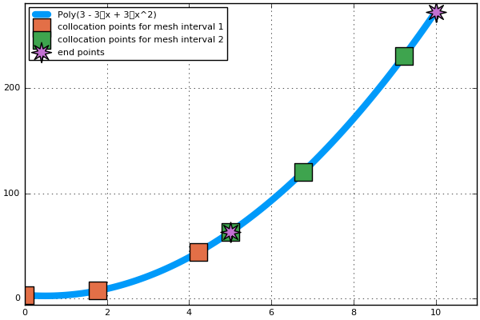

Approximation of :math:`Y^{(k)}(τ)` -> ex#2
============================================
In the previous example, we neglected the approximation of the final state in each interval :math:`Y^(k)(τ)`.

In this example, we will demonstrate calculation of this state.

where:
 .. math:: y(x) = 3x^2-3x+3

with:
  ::

    Nc = Int64(3); # number of collocation points in each interval
    Ni = Int64(2);  # number of intervals

.. sidebar::  Why Do We Need This State?

  It is needed to make the constraint that the states at the end of each mesh grid are equal.
