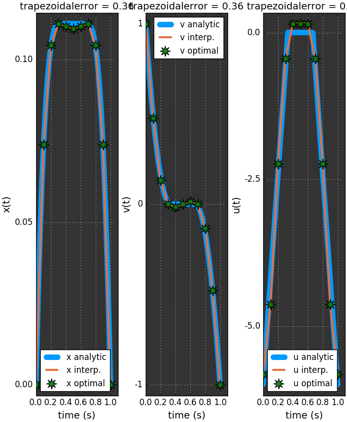
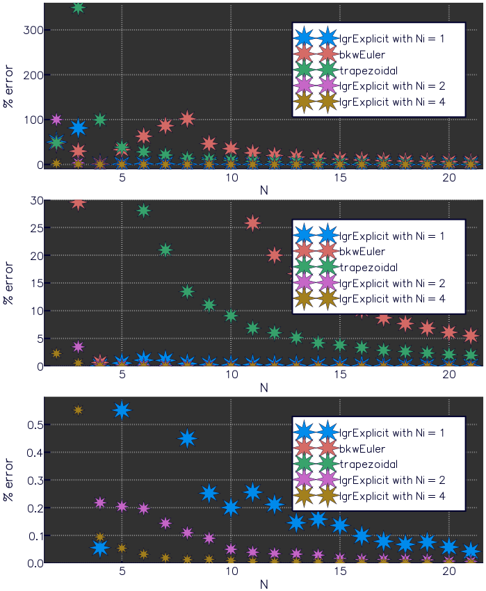
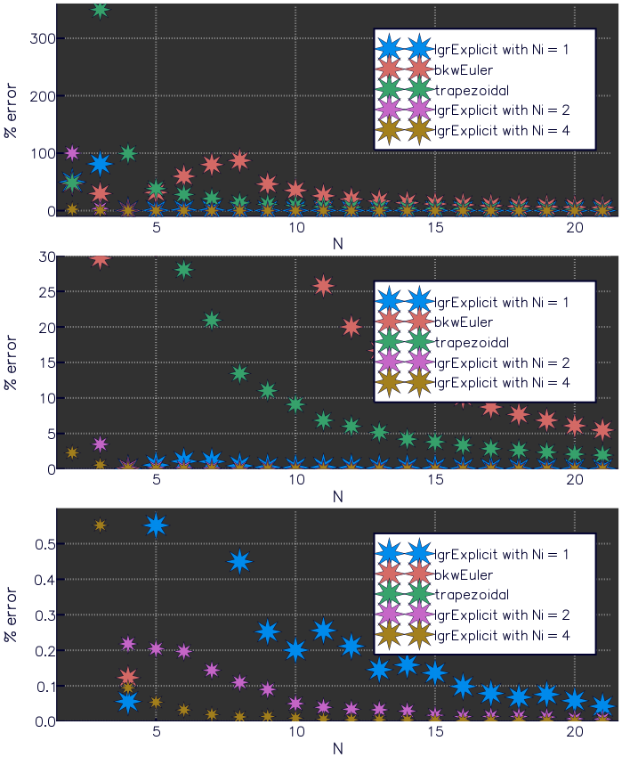

****************
Bryson-Denham
****************
http://www.gpops2.com/Examples/Bryson-Denham.html

``N = 10`` --> ex#6
######################

LGR
---
.. image:: test6a_l.png

Bkw Euler
----------
.. image:: test6a_e.png

Trapezoidal
-----------

Error vs. Speed --> ex#5
############################

Initial Solve
--------------
.. image:: test5a1.png

.. image:: test5c1.png

Second Solve
-------------

.. image:: test5a2.png

.. image:: test5c2.png
